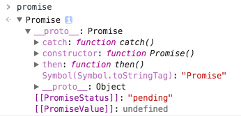

## Promise总结

因为最近项目中用到了ajax，想尝试下Promise，所以看了下ES6中的[Promise](http://es6.ruanyifeng.com/#docs/promise)。

一般用法：
```javascript
// promise表示一个Promise对象
promise
  .then(function (data) {
    // success
  })
  .catch(function (err) {
    // error
  })
```
所以如果使用jQuery或者zepto，可以这样：
```javascript
var ajaxBack = $.ajax({
  url: '*****'
})

ajaxBack
  .then(data => {
    // 处理数据
  })
  .catch(error => {
    // 处理报错
  })
```

### 什么是Promise对象？

Promise是异步编程的一种解决方案。  
首先，我们通过chrome浏览器控制台来看一下Promise对象的样子。  
在控制台输入`Promise`然后回车，会看到输出`function Promise() { [native code] }`。然后我们new一个Promise出来看一下，`var promise = new Promise(function(){})`，在创建Promise对象时候，必须传递一个函数，否则会报错。  
看一下promise：  
  
包括\_\_proto\_\_，[[PromiseStatus]]，[[PromiseValue]]三个属性，其中\_\_proto\_\_主要包括catch、then、constructor方法。所以我们对Promise的学习主要就是[[PromiseStatus]]，[[PromiseValue]]属性和catch，then方法。

### Promise的三种状态
通过[资料](http://es6.ruanyifeng.com/#docs/promise)，我们会知道Promise对象有三种状态：Pending、Resolved和Rejected。  
Promise构造函数接受一个函数作为参数，该函数有两个参数分别为resolve和reject，我们的创建方法应该是这样`new Promise(function (resolve, reject) {})`。  
这两个参数resolve和reject也是函数，resolve是将Promise对象的状态从Pending变成Resolved，reject是将Promise对象的状态从Pending变成Rejected。  
如果我们执行`var promise = new Promise(function(resolve, reject){resolve()})`，会发现promise中的[[PromiseStatus]]变成了`"resolved"`。如果我们执行`var promise = new Promise(function(resolve, reject){resolve('执行成功')})`，会发现不仅[[PromiseStatus]]变了，[[PromiseValue]]的值变成了`“执行成功”`。(reject函数同理)

    需要注意：
      只有函数中的构造函数参数中的resolve和reject可以改变Promise对象的状态。
      一旦Promise对象的状态改变，就会一直保持这个状态，不能再改变。

### Promise的then函数和catch函数

then函数和catch函数可以理解成对Promise状态的监听函数，不同点在于监听函数需要在事件发生之前创建，而因为Promise中的状态在改变后是不能再次改变的，所以then函数和catch函数可以在Promise对象改变状态之后创建，这样的话，该函数会立即执行。  
then函数接受两个函数作为参数，分别是Promise状态为`Resolved`时执行和状态为`Rejected`时执行。
```javascript
// promise是一个Promise对象
promise.then(function(value) {
  // success
}, function(error) {
  // failure
});
```
then函数中的函数参数是[[PromiseValue]]中的值，即是Promise构造中的resolve()、reject()中的参数。

另外，then函数中的方法是异步的，即使resolve立即执行，then中的函数也在同步函数执行结束之后执行：
```javascript
let promise = new Promise(function(resolve, reject) {
  console.log('Promise');
  resolve();
});

promise.then(function() {
  console.log('Resolved.');
});

console.log('Hi!');

// Promise
// Hi!
// Resolved
```

catch函数相当于.then(null, function () {})，是在发生错误时的回调函数，reject()执行时也算是一种错误发生，所以在执行reject()时，catch中的函数也会被执行。  
所以，最好的方式是reject()发生时候需要执行的函数定义在catch中，而不是在then的第二个参数中，这样无论是reject()还是其他错误都能够被捕获。
```javascript
// bad
promise
  .then(function(data) {
    // success
  }, function(err) {
    // error
  });

// good
promise
  .then(function(data) { //cb
    // success
  })
  .catch(function(err) {
    // error
  });
```

### Promise对象的嵌套
在resolve()和reject()中传递的可以是另一个Promise对象，例如
```javascript
var p1 = new Promise(function (resolve, reject) {
  setTimeout(() => reject(new Error('fail')), 3000)
})

var p2 = new Promise(function (resolve, reject) {
  setTimeout(() => resolve(p1), 1000)
})

p2
  .then(result => console.log(result))
  .catch(error => console.log(error))
// Error: fail
```
p1是一个Promise，3秒之后变为rejected。p2的状态在1秒之后改变，resolve方法返回的是p1。此时，由于p2返回的是另一个Promise，所以后面的then语句都变成针对后者（p1）。又过了2秒，p1变为rejected，导致触发catch方法指定的回调函数。

### 其他函数

#### Promise.all()
Promise.all()将多个Promise包装成一个Promise对象，只有在包装的多个Promise都转变成`Resolved`状态，此Promise.all()才会转变成`Resolved`状态，返回值是多个Promise返回值组成的数组；如果有其中一个转变成了`Rejected`状态，则此Promise.all()变成`Rejected`状态，返回值是第一个被reject的返回值。

#### Promise.race()
Promise.race()可以理解成Promise.all()的“否命题”。  
将多个Promise包装成一个，只要有其中一个状态变成`Resolved`，则此Promise.race()变成`Resolved`，返回值是第一个状态变成`Resolved`的值。

#### Promise.resolve()
Promise.resolve()用于将对象转换成Promise对象。

    1. 参数为Promise对象，方法什么也不做，直接返回。
    2. 参数为一个有then方法的对象，方法将对象转换成Promise对象，并立即执行then方法。例如：Promise.resolve(Object)相当于new Promise(Object.then)
    3. 参数不是具有then方法的对象，或者不是对象，则返回一个状态为`Resolved`的Promise对象，并将此参数传递给then中的第一个参数函数。
    4. 不带任何参数，直接返回`Resolved`的Promise对象。

#### Promise.reject()
Promise.reject()和Promise.resolve()行为一致，只是返回的默认是`Rejected`的Promise对象。

#### done()

#### finally()
